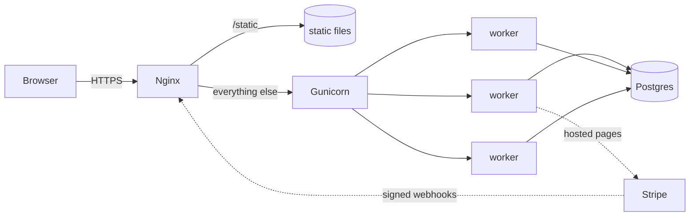
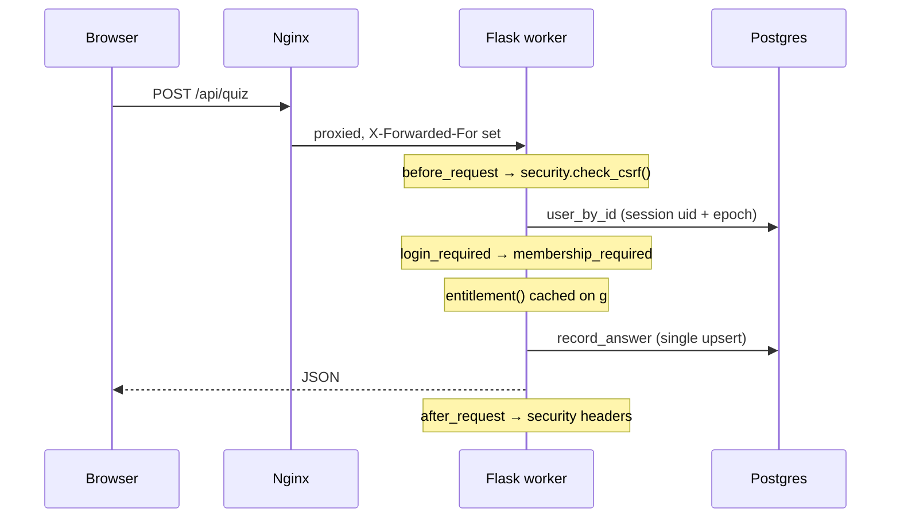
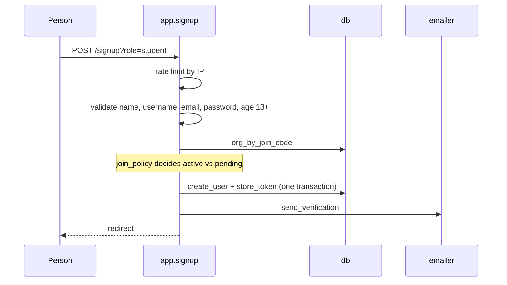
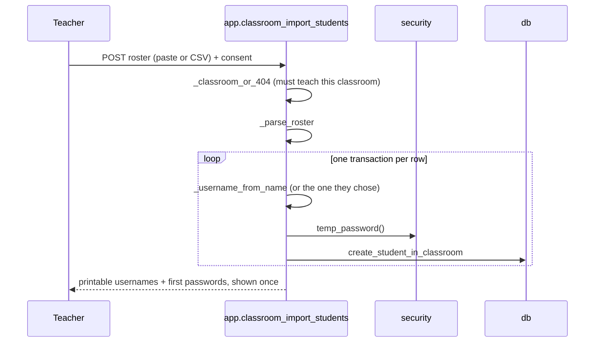
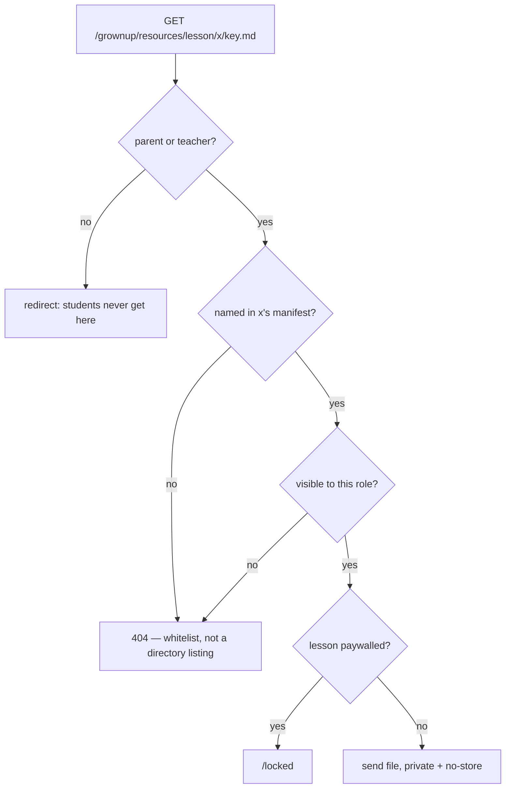
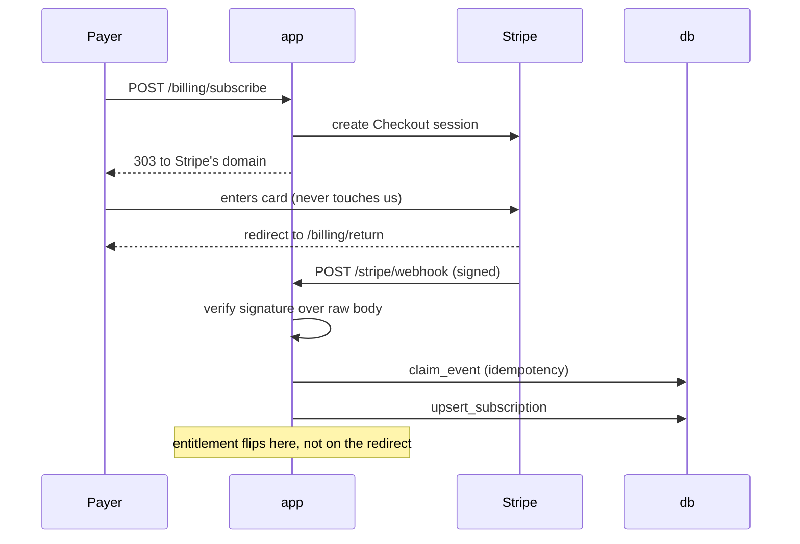
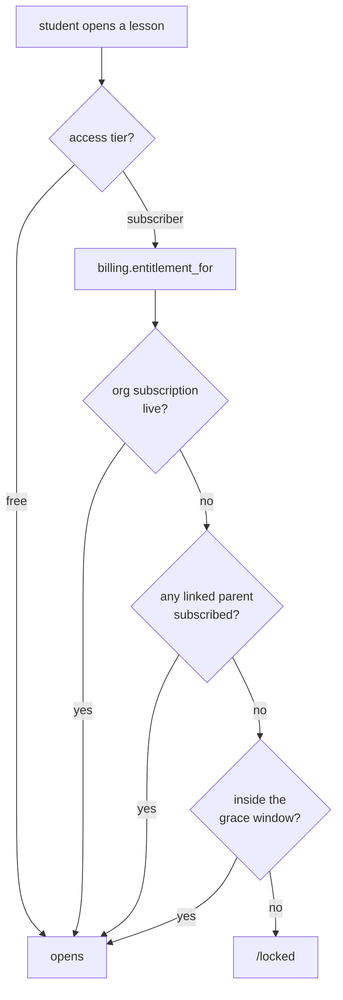

# Architecture

How Ignite Academy is put together, and why it is put together that way.
Read this before changing anything structural — most of the decisions here
were made to fix a specific failure, and the reasons are worth knowing
before you undo one.

- [The shape of it](#the-shape-of-it)
- [Modules](#modules)
- [The rules](#the-rules)
- [A request, end to end](#a-request-end-to-end)
- [Key flows](#key-flows)
- [Content vs state](#content-vs-state)
- [Where the important decisions live](#where-the-important-decisions-live)

---

## The shape of it

A server-rendered Flask app on Postgres. No JavaScript framework, no API
gateway, no message queue. Lessons are self-contained folders rendered in
same-origin iframes; everything else is Jinja templates and form posts.



Each gunicorn worker is an ordinary process with its own connection pool.
Nothing durable is written to local disk, which is the property that lets
you run N workers and N containers and replace any of them at will.

The ceiling on database connections is `WEB_CONCURRENCY × DB_POOL_MAX`.
Raise one without checking the other and you will hit "too many
connections" under exactly the load you were scaling for.

---

## Modules

Everything lives in `game/` as a flat set of modules. There is no package
nesting, because at ~13,000 lines it would be filing rather than
organisation.

| Module | Layer | What it owns |
|---|---|---|
| `wsgi.py` | entrypoint | Production import target. Calls `init_app()` once per worker. |
| `manage.py` | entrypoint | Operator CLI — invoice approval, comps, seat sync, deactivation, erasure. |
| `migrate_json.py` | entrypoint | One-way import from the old JSON store. |
| `import_assets.py` | entrypoint | Sorts a folder of artwork into `static/art/`. |
| `selftest*.py` | entrypoint | Seven suites — see [the roster](../README.md#tests). |
| `app.py` | web | Every route. Request lifecycle, template data, HTTP status. |
| `billing.py` | service | Stripe, and the single answer to "is this account paid up?". |
| `tracks.py` | service | Lessons in a deliberate order, who they are for, and what blocks them. |
| `standards.py` | service | US curriculum frameworks, and where a student lands against a grade. |
| `security.py` | service | CSRF, rate limiting, redirect safety, headers, input rules. |
| `emailer.py` | service | Verification and reset mail. Console or SMTP. |
| `db.py` | data | Schema migrations and every SQL statement in the system. |
| `config.py` | platform | Environment parsing, and boot-time validation. |
| `logsetup.py` | platform | JSON logs in production, readable ones in development. |

`docs/CALLGRAPH.md` has the generated version of this, including which
route touches which module. Regenerate it with
`python scripts/callgraph.py`.

---

## The rules

Four constraints hold this together. Each exists because breaking it
caused a real problem.

### 1. Dependencies point downward

`entrypoint → web → service → data → platform`. A module may use anything
in a lower layer and nothing above it. `db.py` never imports `app.py`;
`billing.py` never touches a Flask request.

This is checked mechanically, because the mistake is invisible in review —
a single `import app` inside `db.py` reads as harmless and quietly welds
two layers together:

```bash
python scripts/callgraph.py --check
```

### 2. All SQL lives in `db.py`

Not "most". If you find yourself writing a query in `app.py`, add a
function to `db.py` instead. The payoff is that every question about how
data is read or written has exactly one file to search, and the
concurrency guarantees below can be audited in one place.

### 3. No read-modify-write

Every mutation is a single statement that lets Postgres resolve the race:

```python
INSERT INTO lesson_progress (...) VALUES (...)
ON CONFLICT (student_id, lesson_id) DO UPDATE SET
    score = GREATEST(COALESCE(lesson_progress.score, 0), COALESCE(EXCLUDED.score, 0)),
    ...
```

This replaced a JSON store that read a whole file, mutated it in Python,
and wrote it back — so two students finishing a quiz in the same second
silently lost one of the two results. Reintroducing a read-then-write
reintroduces that bug. `selftest.py` has a concurrency test that will
catch it.

### 4. Nothing durable on local disk

Session keys, uploads, counters — all of it goes to Postgres or the
environment. Rate limiting lives in a database table specifically because
an in-process counter resets on deploy and is sidestepped by landing on a
different worker.

---

## A request, end to end



The order matters:

1. **`before_request` → `security.check_csrf()`.** Form posts carry a
   token; `/api/` routes must be `application/json`, which a cross-origin
   form cannot send; routes marked `@csrf_exempt` (only the Stripe
   webhook) skip both. The exemption is keyed on the resolved view
   function, never on the URL, so a new route cannot inherit it by
   accident.

2. **`current_user()`.** Reads `uid` and `epoch` from the signed session
   cookie and validates both against the database. Changing a password
   bumps `session_epoch`, which retroactively invalidates every cookie
   issued before it. Cached on `g` for the request.

3. **Guards, in decorator order.** `login_required` → `membership_required`
   → the handler. A pending member has a real account but no seat, so they
   are redirected to `/pending` rather than shown a 403.

4. **`entitlement()`.** Resolved once and cached on `g`. Everything about
   paid access is decided in `billing.entitlement_for()`.

5. **`after_request`.** Security headers on every response.

6. **`teardown_appcontext`.** Clears the cached user and entitlement.

Errors take two paths: `HTTPException` keeps its own status (a 404 stays a
404), and everything else logs a traceback and returns a generic 500. That
split matters — a single handler registered for `Exception` also catches
`HTTPException`, which turned every 405 into a 500 until it was fixed.

---

## Key flows

### Signing up



A teacher's signup creates the organisation and makes them its first
admin. Students and parents must present that org's join code, so an
account cannot appear inside a school nobody invited it to.

This is one of two ways a student account comes into being. The other is a
teacher provisioning it — no email, no join code, no confirmation link —
covered under [Getting a class online](#getting-a-class-online-without-email-addresses)
below.

The username and email checks before the insert are for a friendly error
message only — the unique indexes are what actually prevent a duplicate
when two people race.

### Getting a class online without email addresses

Self-serve signup asks for an email and sends a confirmation link. That
works for a parent at a kitchen table and fails completely for a class of
twenty-eight, so a teacher creates the accounts directly instead.



Three properties worth keeping if you touch this:

- **A row fails alone.** Each student is its own transaction, so one
  duplicate username on line nine does not defeat an import of thirty.
  Failures come back beside the successes on the results page.
- **The password is shown once and never stored.** Only the scrypt hash is
  kept, so the page cannot be rebuilt. That is why it renders a results
  page rather than flashing a message — a flash would follow the teacher
  onto the next screen and into the session cookie.
- **Any teacher of the classroom can do it**, not just an admin.
  `_classroom_or_404()` has already refused anyone who does not teach it,
  and making a teacher wait for an admin to enrol their own class is the
  friction the whole flow exists to remove. Moving an *existing* student
  between classrooms stays admin-only — that one hands a teacher sight of
  somebody else's pupils.

### Handing back a forgotten password

The email reset loop is useless to a student with no email address, and
most of them have none, so a teacher can issue a new password directly.

`POST /grownup/student/<username>/reset-password` →
`_visible_student_or_404()` → `db.set_password(..., must_change=True)`.

Two guards do the real work. `_visible_student_or_404()` refuses anyone
outside the teacher's own classrooms *and* refuses any account that is not
a student — a teacher must never be able to reset another teacher's or the
org admin's password, or one borrowed staff login becomes the whole school.
And `set_password` bumps `session_epoch`, so the reset signs the student out
of whatever device they left themselves logged in on.

Deletion is deliberately stricter than a reset: a reset is recoverable and
routine, so any teacher of the classroom may do it, while deleting a
student is admin-only and needs `DELETE` typed into a box.

### Keeping an answer key away from the student it is about

Grown-up material — parent guides, answer keys, worksheets — is attached to
a lesson or a track in its manifest and lives in `game/resources/`.

That directory is the whole design. Two existing ways to serve a file in
this app have **no authentication on them at all**: nginx aliases
`/static/` straight off disk, so no Python runs, and `/lessons/<id>/<file>`
is deliberately open because lesson artwork must load inside the game
frame. A guide in either is public to every student with a browser.



Four checks, and the third is the one that makes accidents survivable: a
file sitting in the directory that no manifest names cannot be fetched by
guessing its name. `app._without_resources()` adds a fourth line of defence
by stripping the list before a lesson reaches a student's template context,
so a future partial or serialiser has nothing to leak.

### The forced first password

An account whose password somebody else chose carries
`must_change_password`. `app._force_password_change()` is a
`before_request` hook that bounces every endpoint outside
`_PASSWORD_CHANGE_EXEMPT` to `/settings/first-password`, and answers
`/api/` with a 403 rather than a redirect.

It is a hook rather than a decorator on purpose: a route added later is
covered by default, and the failure mode of forgetting to exempt something
is a redirect, not a hole. The exempt set holds the static and asset
endpoints too, so the gate never costs a database lookup on a file request.

### Answering a quiz question

`POST /api/quiz` → `db.record_answer()`. Two statements in one
transaction: touch `lesson_progress` so the lesson counts as started, then
upsert `quiz_answers`.

`tries` increments *in the database*, so two answers submitted at once
both count. `first_try` is written once — on the first correct answer —
and never overwritten, which is what makes the score mean "got it right
without help".

The answer key never leaves the server. `/lesson/<id>` strips it out of
the payload and `/api/quiz` does the marking.

### Paying



`/billing/return` grants nothing — anyone can visit that URL. Access
changes only when the signed webhook lands. Getting this backwards is the
classic payments bug.

Webhooks retry and arrive out of order, so every event id is claimed in
`stripe_events` before being applied, a handler that throws releases its
claim so the retry can work, and unhandled event types are acknowledged
with 200 rather than a non-2xx that would make Stripe retry forever.

### Deciding whether a lesson opens



Lessons are free unless a manifest sets `"access": "subscriber"` —
defaulting the other way would have locked all existing content the moment
a Stripe key appeared in the environment. An unrecognised tier also falls
back to free, so a typo fails open rather than shut.

A lesson may also declare a **kit** — a physical box of parts. That is
purely informational and never affects access; it is a badge on the card
and a banner on the lesson.

A lesson in a **sequential track** has a second, independent gate: it stays
shut until the lesson before it is finished. That is pedagogy rather than
payment, and it is kept well away from the subscription check — a student
needs to tell "you haven't got there yet" from "this needs a
subscription", because the remedies are completely different.

Gating is enforced on the lesson page **and** on every API route. The page
can simply be skipped, so the API is the real boundary.

---

## Content vs state

A distinction worth internalising, because it decides where a new thing
belongs.

**Content** ships with the code and changes on deploy. Lesson manifests,
track manifests, `data/items.json`, `data/classroom.json`, art. It lives in files, is read
once at start-up by `refresh_catalog()`, and is cached in memory. It used
to be re-scanned and re-parsed on every request — once per answered quiz
question, among others.

**State** is created by users at runtime. Accounts, progress, classrooms,
subscriptions. It lives in Postgres, always.

If you are adding something and cannot tell which it is, ask whether two
workers could disagree about it. If they could, it is state.

---

## Where the important decisions live

When something is behaving unexpectedly, these are the single places
responsible:

| Question | One place |
|---|---|
| Is this account paid up? | `billing.entitlement_for()` |
| Who can see this student? | `db.visible_students()`, `db.can_see_student()` |
| Has the student reached this lesson? | `app.prerequisite_block()` |
| Is that a sequence, a prerequisite or an unassigned lesson? | `tracks.requirement_block()`, then `tracks.gate()` |
| Who is this lesson for, and what does it lean on? | `tracks.band()`, `tracks.skills()` |
| May this person see this guide? | `tracks.visible_resources()`, then `app._resource_or_404()` |
| Is this request authentic? | `security.check_csrf()` |
| Who is signed in? | `app.current_user()` |
| Is this lesson free? | `billing.lesson_access()` |
| Where does this child stand against their grade? | `standards.report()` |
| May this account move around yet? | `app._force_password_change()` |
| May this account be deleted? | `app._deletion_blocker()` |
| What does deleting an account remove? | `db.delete_user()` |
| What colour is anything? | `static/kit/brand.css` |
| What does the schema look like? | `db.MIGRATIONS` |
| What can be configured? | `config.Config` |

Each of these is deliberately the only implementation. If you find
yourself writing a second answer to one of these questions somewhere else,
that is the bug.

---

**Next:** [Data model](DATA_MODEL.md) · [Extending it](EXTENDING.md) ·
[Call graph](CALLGRAPH.md)
