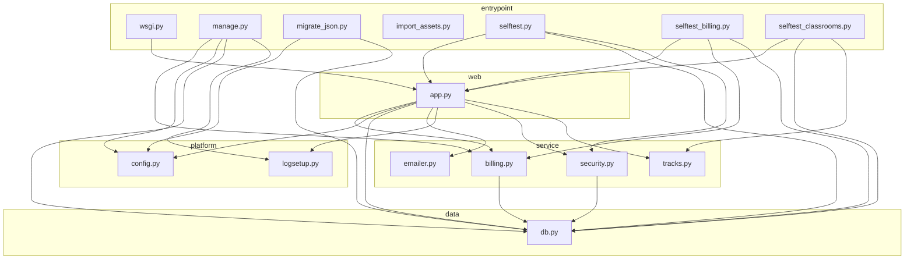

# Call graph

**Generated — do not edit.** Regenerate with `python scripts/callgraph.py`
after changing routes or module imports.

Built by walking the AST of everything in `game/`. It answers three
questions: how the modules stack up, what a given route touches, and
whether anything is wired backwards.

---

## Module layers

Dependencies run downward only. A module may use anything in a layer
below it and nothing above — routes call services, services call data,
and nothing calls back up.

No layering violations: every import points downward.

---

## Routes

49 routes. **Guards** are the decorators that must pass before
the handler runs; **touches** is every other module the handler reaches,
following local helpers.

| Route | Methods | Guards | Handler | Touches |
|---|---|---|---|---|
| `/` | GET | — | `app.home` | `db` |
| `/api/example` | POST | signed in | `app.api_example` | `billing`, `db`, `tracks` |
| `/api/examples/<lesson_id>` | GET | signed in | `app.api_examples` | `billing`, `db`, `tracks` |
| `/api/progress` | POST | signed in | `app.api_progress` | `billing`, `db`, `tracks` |
| `/api/quiz` | POST | signed in | `app.api_quiz` | `billing`, `db`, `tracks` |
| `/api/quiz/finish` | POST | signed in | `app.api_quiz_finish` | `billing`, `db`, `tracks` |
| `/art-placeholder/<path:name>` | GET | — | `app.art_placeholder` | — |
| `/art/<path:name>` | GET | — | `app.art_url` | — |
| `/billing` | GET | signed in, approved member | `app.billing_home` | `billing`, `db` |
| `/billing/invoice-request` | POST | org admin | `app.billing_invoice_request` | `db`, `emailer`, `security` |
| `/billing/portal` | POST | signed in, approved member | `app.billing_portal` | `billing`, `db` |
| `/billing/return` | GET | signed in | `app.billing_return` | `billing`, `db` |
| `/billing/subscribe` | POST | signed in, approved member | `app.billing_subscribe` | `billing`, `db` |
| `/classroom` | GET | signed in, approved member | `app.classroom` | `db` |
| `/classrooms` | GET | signed in, approved member | `app.classrooms_home` | `db` |
| `/classrooms/<int:classroom_id>` | GET | signed in, approved member | `app.classroom_detail` | `db` |
| `/classrooms/<int:classroom_id>/delete` | POST | org admin | `app.classroom_delete` | `db` |
| `/classrooms/<int:classroom_id>/students/add` | POST | org admin | `app.classroom_add_student` | `db` |
| `/classrooms/<int:classroom_id>/students/remove` | POST | org admin | `app.classroom_remove_student` | `db` |
| `/classrooms/<int:classroom_id>/teachers/add` | POST | org admin | `app.classroom_add_teacher` | `db` |
| `/classrooms/<int:classroom_id>/teachers/remove` | POST | org admin | `app.classroom_remove_teacher` | `db` |
| `/classrooms/new` | POST | org admin | `app.classroom_create` | `db` |
| `/forgot` | GET/POST | — | `app.forgot_password` | `db`, `emailer`, `security` |
| `/grownup` | GET | signed in, approved member | `app.grownup_home` | `db` |
| `/grownup/link` | POST | signed in | `app.link_child` | `db` |
| `/grownup/student/<username>` | GET | signed in | `app.student_detail` | `db` |
| `/grownup/student/<username>/assign` | POST | signed in | `app.student_assign` | `db` |
| `/healthz` | GET | — | `app.healthz` | `db` |
| `/kit/<path:filename>` | GET | — | `app.kit_asset` | — |
| `/lesson/<lesson_id>` | GET | signed in, approved member | `app.lesson` | `billing`, `db`, `tracks` |
| `/lessons` | GET | signed in, approved member | `app.lessons` | `billing`, `db`, `tracks` |
| `/lessons/<lesson_id>/<path:filename>` | GET | — | `app.lesson_asset` | — |
| `/livez` | GET | — | `app.livez` | — |
| `/locked` | GET | signed in | `app.locked` | `billing`, `db`, `tracks` |
| `/login` | GET/POST | — | `app.login` | `db`, `security` |
| `/logout` | POST | — | `app.logout` | — |
| `/org` | GET | org admin | `app.org_home` | `billing`, `db` |
| `/org/join-policy` | POST | org admin | `app.org_join_policy` | `db` |
| `/org/members/<member_id>/admin` | POST | org admin | `app.org_set_admin` | `db` |
| `/org/members/<member_id>/approve` | POST | org admin | `app.org_approve_member` | `billing`, `db` |
| `/org/members/<member_id>/remove` | POST | org admin | `app.org_remove_member` | `billing`, `db` |
| `/org/rotate-code` | POST | org admin | `app.org_rotate_code` | `db` |
| `/pending` | GET | signed in | `app.pending` | `db` |
| `/reset/<token>` | GET/POST | — | `app.reset_password` | `db`, `security` |
| `/satchel` | GET | signed in, approved member | `app.satchel` | `db` |
| `/signup` | GET/POST | — | `app.signup` | `db`, `emailer`, `security` |
| `/stripe/webhook` | POST | CSRF exempt | `app.stripe_webhook` | `billing`, `db` |
| `/verify/<token>` | GET | — | `app.verify_email` | `db`, `security` |
| `/verify/resend` | POST | — | `app.resend_verification` | `db`, `emailer`, `security` |

---

## What each route calls

Expanded one level through local helpers, so this is what the
handler ultimately reaches — not just what its own body names.

### `GET /`

Send each role to the screen it actually wants.

`app.home` — game/app.py:648

- **db** → `user_by_id`

### `POST /api/example`

Record one practice-example answer and hand back the same correct/explain shape /api/quiz gives — Spark uses i

`app.api_example` — game/app.py:1349

- **billing** → `entitlement_for`, `lesson_is_free`
- **db** → `assigned_lesson_ids`, `lesson_statuses`, `record_example`, `user_by_id`
- **tracks** → `gate`

### `GET /api/examples/<lesson_id>`

Prompts and choices for a lesson's practice examples, answer key stripped — the same treatment the quiz gets.

`app.api_examples` — game/app.py:1329

- **billing** → `entitlement_for`, `lesson_is_free`
- **db** → `assigned_lesson_ids`, `lesson_statuses`, `user_by_id`
- **tracks** → `gate`

### `POST /api/progress`

Called by the lesson player, and by lessons via the kit's postMessage.

`app.api_progress` — game/app.py:1262

- **billing** → `entitlement_for`, `lesson_is_free`
- **db** → `assigned_lesson_ids`, `lesson_statuses`, `set_lesson_status`, `summaries_for`, `user_by_id`
- **tracks** → `gate`

### `POST /api/quiz`

Check one answer and record the attempt.

`app.api_quiz` — game/app.py:1292

- **billing** → `entitlement_for`, `lesson_is_free`
- **db** → `assigned_lesson_ids`, `lesson_statuses`, `record_answer`, `user_by_id`
- **tracks** → `gate`

### `POST /api/quiz/finish`

Score the quiz, complete the lesson, and hand back any reward earned.

`app.api_quiz_finish` — game/app.py:1388

- **billing** → `entitlement_for`, `lesson_is_free`
- **db** → `assigned_lesson_ids`, `lesson_entries`, `lesson_statuses`, `set_lesson_status`, `summaries_for`, `user_by_id`
- **tracks** → `gate`

### `GET /billing`

`app.billing_home` — game/app.py:2023

- **billing** → `entitlement_for`
- **db** → `count_billable_seats`, `invoices_for`, `org_by_id`, `subscription_for_org`, `subscription_for_parent`, `user_by_id`, `visible_students`

### `POST /billing/invoice-request`

Ask to be billed by invoice on terms instead of by card.

`app.billing_invoice_request` — game/app.py:2128

- **db** → `count_billable_seats`, `org_by_id`, `set_billing_profile`, `user_by_id`
- **emailer** → `send`
- **security** → `email_problem`

### `POST /billing/portal`

Stripe's hosted account page: change card, cancel, download invoices.

`app.billing_portal` — game/app.py:2087

- **billing** → `portal_session`
- **db** → `count_billable_seats`, `org_by_id`, `subscription_for_org`, `subscription_for_parent`, `user_by_id`, `visible_students`

### `GET /billing/return`

Where Stripe sends the browser after Checkout.

`app.billing_return` — game/app.py:2115

- **billing** → `entitlement_for`
- **db** → `user_by_id`

### `POST /billing/subscribe`

Send the payer to Stripe's hosted Checkout.

`app.billing_subscribe` — game/app.py:2042

- **billing** → `checkout_session`, `enabled`, `ensure_customer`
- **db** → `count_billable_seats`, `org_by_id`, `subscription_for_org`, `subscription_for_parent`, `user_by_id`, `visible_students`

### `GET /classroom`

`app.classroom` — game/app.py:1120

- **db** → `summaries_for`, `user_by_id`

### `GET /classrooms`

Every classroom this account may see.

`app.classrooms_home` — game/app.py:1590

- **db** → `classroom_membership`, `classroom_rows`, `summaries_for`, `unplaced_students`, `unresolved_counts`, `user_by_id`, `visible_students`

### `GET /classrooms/<int:classroom_id>`

One classroom: who teaches it, who is in it, how they are doing.

`app.classroom_detail` — game/app.py:1680

- **db** → `classroom_in_org`, `classroom_students`, `classroom_teachers`, `org_teachers`, `summaries_for`, `teaches_classroom`, `unresolved_counts`, `user_by_id`, `visible_students`

### `POST /classrooms/<int:classroom_id>/delete`

Delete a classroom.

`app.classroom_delete` — game/app.py:1804

- **db** → `delete_classroom`, `user_by_id`

### `POST /classrooms/<int:classroom_id>/students/add`

Put a student in a classroom, which is what lets its teachers see them.

`app.classroom_add_student` — game/app.py:1731

- **db** → `add_classroom_student`, `can_see_student`, `classroom_in_org`, `teaches_classroom`, `user_by_id`, `user_by_username`

### `POST /classrooms/<int:classroom_id>/students/remove`

Take a student out of a classroom.

`app.classroom_remove_student` — game/app.py:1749

- **db** → `can_see_student`, `classroom_in_org`, `remove_classroom_student`, `teaches_classroom`, `user_by_id`, `user_by_username`

### `POST /classrooms/<int:classroom_id>/teachers/add`

Assign a teacher to a classroom.

`app.classroom_add_teacher` — game/app.py:1766

- **db** → `add_classroom_teacher`, `classroom_in_org`, `member_in_org`, `teaches_classroom`, `user_by_id`

### `POST /classrooms/<int:classroom_id>/teachers/remove`

Unassign a teacher, revoking their sight of that classroom's students.

`app.classroom_remove_teacher` — game/app.py:1787

- **db** → `classroom_in_org`, `member_in_org`, `remove_classroom_teacher`, `teaches_classroom`, `user_by_id`

### `POST /classrooms/new`

Create a classroom and put its creator in it.

`app.classroom_create` — game/app.py:1655

- **db** → `add_classroom_teacher`, `create_classroom`, `user_by_id`

### `GET/POST /forgot`

`app.forgot_password` — game/app.py:881

- **db** → `invalidate_tokens`, `store_token`, `user_by_email`, `write`
- **emailer** → `send_reset`
- **security** → `client_ip`, `new_token`, `over_limit`, `record_attempt`

### `GET /grownup`

Answers "is my kid doing the work?" without any digging: a headline per student, and anything needing attentio

`app.grownup_home` — game/app.py:1429

- **db** → `org_by_id`, `summaries_for`, `unresolved_counts`, `user_by_id`, `visible_students`

### `POST /grownup/link`

A parent attaches themselves to a student with the student's link code.

`app.link_child` — game/app.py:1552

- **db** → `link_parent`, `student_by_link_code`, `user_by_id`

### `GET /grownup/student/<username>`

One student's full progress, for a grown-up.

`app.student_detail` — game/app.py:1489

- **db** → `assigned_lesson_ids`, `can_see_student`, `lesson_entries`, `summaries_for`, `user_by_id`, `user_by_username`

### `POST /grownup/student/<username>/assign`

Narrow (or re-widen) which lessons show up on one student's menu.

`app.student_assign` — game/app.py:1532

- **db** → `can_see_student`, `set_assignment`, `user_by_id`, `user_by_username`

### `GET /healthz`

Readiness: can this process actually do its job right now?

`app.healthz` — game/app.py:504

- **db** → `healthy`

### `GET /lesson/<lesson_id>`

Open one lesson, if this student may.

`app.lesson` — game/app.py:1186

- **billing** → `entitlement_for`, `lesson_is_free`
- **db** → `assigned_lesson_ids`, `lesson_entries`, `lesson_statuses`, `set_lesson_status`, `summaries_for`, `user_by_id`
- **tracks** → `gate`

### `GET /lessons`

The lesson menu, organised by track.

`app.lessons` — game/app.py:1131

- **billing** → `entitlement_for`, `lesson_is_free`
- **db** → `assigned_lesson_ids`, `lesson_entries`, `summaries_for`, `user_by_id`
- **tracks** → `gate`, `progress`

### `GET /locked`

Where a student lands on a lesson that will not open.

`app.locked` — game/app.py:1822

- **billing** → `entitlement_for`
- **db** → `assigned_lesson_ids`, `lesson_statuses`, `user_by_id`
- **tracks** → `gate`

### `GET/POST /login`

`app.login` — game/app.py:665

- **db** → `touch_login`, `user_by_id`, `user_by_username`
- **security** → `clear_attempts`, `client_ip`, `over_limit`, `record_attempt`, `rotate_csrf_token`, `safe_next`

### `GET /org`

`app.org_home` — game/app.py:1857

- **billing** → `entitlement_for`
- **db** → `count_billable_seats`, `count_org_admins`, `org_by_id`, `org_members`, `pending_members`, `subscription_for_org`, `user_by_id`

### `POST /org/join-policy`

`app.org_join_policy` — game/app.py:1891

- **db** → `set_join_policy`, `user_by_id`

### `POST /org/members/<member_id>/admin`

`app.org_set_admin` — game/app.py:1947

- **db** → `count_org_admins`, `member_in_org`, `set_org_admin`, `user_by_id`

### `POST /org/members/<member_id>/approve`

`app.org_approve_member` — game/app.py:1914

- **billing** → `enabled`, `update_seats`
- **db** → `count_billable_seats`, `member_in_org`, `set_membership_status`, `subscription_for_org`, `user_by_id`

### `POST /org/members/<member_id>/remove`

`app.org_remove_member` — game/app.py:1926

- **billing** → `enabled`, `update_seats`
- **db** → `count_billable_seats`, `count_org_admins`, `member_in_org`, `set_membership_status`, `subscription_for_org`, `user_by_id`

### `POST /org/rotate-code`

`app.org_rotate_code` — game/app.py:1905

- **db** → `rotate_join_code`, `user_by_id`

### `GET /pending`

Holding page for a member an admin has not let in yet.

`app.pending` — game/app.py:622

- **db** → `org_by_id`, `user_by_id`

### `GET/POST /reset/<token>`

`app.reset_password` — game/app.py:911

- **db** → `consume_token`, `set_password`
- **security** → `clear_attempts`, `hash_token`, `password_problem`

### `GET /satchel`

The student's trinket collection.

`app.satchel` — game/app.py:1239

- **db** → `inventory`, `summaries_for`, `user_by_id`

### `GET/POST /signup`

Self-serve registration for all three roles.

`app.signup` — game/app.py:726

- **db** → `create_org`, `create_user`, `email_taken`, `org_by_join_code`, `store_token`, `user_by_id`, `username_taken`, `write`
- **emailer** → `send_verification`
- **security** → `client_ip`, `email_problem`, `new_token`, `over_limit`, `password_problem`, `record_attempt`, `rotate_csrf_token`, `username_problem`

### `POST /stripe/webhook`

`app.stripe_webhook` — game/app.py:2181

- **billing** → `enabled`, `handle_event`, `verify_webhook`
- **db** → `claim_event`, `finish_event`, `release_event`

### `GET /verify/<token>`

`app.verify_email` — game/app.py:842

- **db** → `consume_token`, `mark_verified`, `write`
- **security** → `hash_token`, `rotate_csrf_token`

### `POST /verify/resend`

`app.resend_verification` — game/app.py:857

- **db** → `invalidate_tokens`, `store_token`, `user_by_email`, `write`
- **emailer** → `send_verification`
- **security** → `client_ip`, `new_token`, `over_limit`, `record_attempt`

---

## Module summary

| Module | Layer | Functions | Routes | Imports |
|---|---|---|---|---|
| `import_assets.py` | entrypoint | 5 | 0 | — |
| `manage.py` | entrypoint | 12 | 0 | `billing`, `config`, `db`, `logsetup` |
| `migrate_json.py` | entrypoint | 3 | 0 | `config`, `db` |
| `selftest.py` | entrypoint | 42 | 0 | `app`, `db`, `security` |
| `selftest_billing.py` | entrypoint | 50 | 0 | `app`, `billing`, `db` |
| `selftest_classrooms.py` | entrypoint | 35 | 0 | `app`, `db`, `tracks` |
| `wsgi.py` | entrypoint | 0 | 0 | `app` |
| `app.py` | web | 94 | 49 | `billing`, `config`, `db`, `emailer`, `logsetup`, `security`, `tracks` |
| `billing.py` | service | 21 | 0 | `db` |
| `emailer.py` | service | 4 | 0 | — |
| `security.py` | service | 17 | 0 | `db` |
| `tracks.py` | service | 9 | 0 | — |
| `db.py` | data | 88 | 0 | — |
| `config.py` | platform | 3 | 0 | — |
| `logsetup.py` | platform | 2 | 0 | — |
