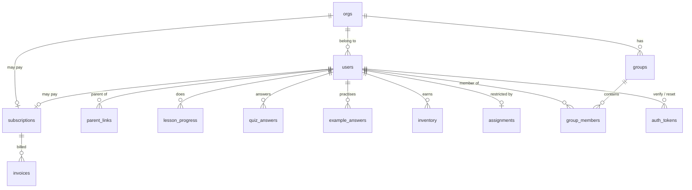

# Data model

Every table, what it is for, and the constraint that makes it correct.

Schema lives in `db.MIGRATIONS` as an append-only list. **Never edit a
migration that has shipped** — add another one. Each entry is applied in a
transaction, under a Postgres advisory lock so several workers booting
together cannot race.

- [Overview](#overview)
- [Identity and membership](#identity-and-membership)
- [Learning](#learning)
- [Teaching](#teaching)
- [Billing](#billing)
- [Infrastructure](#infrastructure)
- [Constraints that do real work](#constraints-that-do-real-work)

---

## Overview



Three things to notice:

- **`orgs` is the privacy boundary.** Every user belongs to exactly one.
  Cross-org access is not a permission that happens to be off — it is not
  expressible.
- **`subscriptions` hangs off either an org or a user**, never both. A
  `CHECK` enforces that rather than trusting the application to remember.
- **Everything cascades from `users`.** Deleting a user row removes their
  progress, answers, inventory and memberships. That is what makes a
  deletion request answerable.

---

## Identity and membership

### `orgs`

A school, club or class. Created by the first teacher to sign up.

| Column | Notes |
|---|---|
| `id` | |
| `name` | |
| `join_code` | 8 chars, no `0/O/1/I/L` — it gets read aloud in a classroom |
| `join_policy` | `open` \| `approval` |
| `billing_email` | Where invoices go; may differ from the admin's own address |
| `billing_terms` | `card` \| `invoice` |
| `po_number` | Quoted on invoices |
| `tax_exempt` | Schools often are |
| `invoice_requested_at` | Set when an admin asks for net-30 |
| `invoice_approved_at` | Set only by `manage.py approve-invoice` |

The two invoice timestamps are separate on purpose: **asking is not being
granted.** Net 30 is unsecured credit, so a human decides.

### `users`

Students, parents and teachers in one table — they share authentication,
sessions and org membership, and differ only in `role`.

| Column | Notes |
|---|---|
| `org_id` | The privacy boundary |
| `username`, `email` | Unique on `lower()`, so `Alex` and `alex` are one account |
| `password_hash` | Werkzeug scrypt |
| `role` | `student` \| `parent` \| `teacher` |
| `org_admin` | Controls the roster and the money. Teachers only |
| `membership_status` | `active` \| `pending` \| `removed` |
| `session_epoch` | Bumped on password change; invalidates every existing cookie |
| `email_verified` | |
| `is_active` | Operator-level off switch |
| `link_code` | 6 chars, students only — a parent types it to link themselves |
| `age_confirmed_at` | The 13+ attestation, with the time it was made |
| `terms_accepted_at` | |

`session_epoch` is the mechanism that makes a password reset actually
throw an attacker out. The session cookie carries the epoch it was issued
under; `current_user()` refuses any cookie whose epoch no longer matches.

### `parent_links`

Many-to-many between parents and students. A child can have two parents;
a parent can have several children. Created when a parent enters a
student's `link_code`, scoped to their own org so a guessed code cannot
reach across schools.

---

## Learning

### `lesson_progress`

One row per student per lesson. PK `(student_id, lesson_id)`.

`lesson_id` is a folder name under `game/lessons/`, deliberately not a
foreign key — lessons are content that ships with the code, and a lesson
being renamed or retired must not break a student's history.

Written only by `db.set_lesson_status()`, whose upsert never walks a
completed lesson back to `in_progress` and keeps the higher of the old and
new score.

### `quiz_answers`

Every graded attempt. PK `(student_id, lesson_id, question_id)`.

| Column | Notes |
|---|---|
| `tries` | Incremented **in SQL**, so simultaneous answers both count |
| `chosen` | Their most recent answer |
| `correct` | Whether that one was right |
| `first_try` | `NULL` until they first answer correctly; then whether that was attempt 1 |

`first_try` is the whole scoring model: it is written once and never
overwritten, so a score means "got it right without help" rather than
"eventually got it right".

### `example_answers`

Practice attempts. Same shape, no `first_try` — practice is never graded
back to the student. It exists so a parent can see how practice is
actually going.

### `inventory`

Trinkets earned. PK `(student_id, item_id)` — that primary key is what
makes a reward grant-once under a double submit, with no read-compare-read
around it.

---

## Teaching

### `groups` / `group_members`

A teacher's arbitrary grouping of students within their org. `groups` is
scoped by `org_id`; every membership operation checks it.

### `assignments`

Optional restriction of a student's lesson menu. PK is `student_id`, with
`lesson_ids text[]`.

**No row means unrestricted.** An empty array is a real, different state:
the teacher has assigned nothing. Storing the list in one row rather than
one row per lesson is what makes those two cases distinguishable.

---

## Billing

### `subscriptions`

One row per Stripe subscription.

| Column | Notes |
|---|---|
| `account_kind` | `org` \| `parent` |
| `org_id` / `user_id` | Exactly one is set — enforced by `CHECK` |
| `stripe_customer_id`, `stripe_subscription_id` | Ids only. **No card data, ever** |
| `status` | Stripe's status, stored verbatim |
| `seats` | Active students, for an org |
| `collection_method` | `charge_automatically` \| `send_invoice` |
| `current_period_end` | Grace windows are measured from here |
| `comp_until` | Access with no Stripe subscription behind it |

`status` is stored verbatim rather than translated into our own
vocabulary, because reinterpreting it would create two sources of truth
that drift apart.

Two partial unique indexes enforce **at most one live subscription per
payer**:

```sql
CREATE UNIQUE INDEX subscriptions_one_live_org ON subscriptions (org_id)
    WHERE org_id IS NOT NULL AND status NOT IN ('canceled','incomplete_expired');
```

Without that, a double-click on the checkout button buys the same school
twice.

### `invoices`

Denormalised from Stripe so a teacher can see what is owed without a live
API call on every page load. Also what `manage.py overdue` reads.

### `stripe_events`

Webhook idempotency. The primary key on `event_id` is the entire defence
against applying an event twice, and Stripe *will* deliver the same event
more than once.

`processed_at` distinguishes "claimed and finished" from "claimed and
still running". A handler that throws deletes its unprocessed row so the
retry can succeed — a transient failure must not become permanent.

---

## Infrastructure

### `auth_tokens`

Verification and password-reset links. **Only the hash is stored**, so a
leaked database row cannot be replayed as a working reset link.

Single use is enforced by the redemption query itself:

```sql
UPDATE auth_tokens SET used_at = now()
WHERE token_hash = %s AND purpose = %s
  AND used_at IS NULL AND expires_at > now()
RETURNING user_id
```

If two requests race on the same link, only one gets a row back.

### `rate_events`

One row per attempt, bucketed by a hash of the username or IP — so the
table never holds a raw identifier. In Postgres rather than memory because
the count has to be shared across workers and survive a deploy.

### `schema_migrations`

Applied version numbers. Written by `db.migrate()` under an advisory lock.

---

## Constraints that do real work

These are not decoration. Each one is load-bearing, and removing it
reintroduces a specific bug:

| Constraint | Prevents |
|---|---|
| `users` unique on `lower(username)` | `Alex` and `alex` becoming two accounts |
| `subscriptions_one_live_*` | Double-clicking checkout buying twice |
| `subscriptions` `CHECK` on kind | A subscription owned by both an org and a user |
| `inventory` PK | A reward granted twice on a double submit |
| `stripe_events` PK | A retried webhook applied twice |
| `quiz_answers` PK | Concurrent answers overwriting rather than counting |
| `ON DELETE CASCADE` throughout | Orphaned rows after a deletion request |

---

**Next:** [Architecture](ARCHITECTURE.md) · [Extending it](EXTENDING.md)
