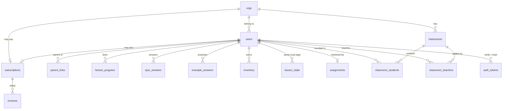

# Data model

Every table, what it is for, and the constraint that makes it correct.

Schema lives in `db.MIGRATIONS` as an append-only list. **Never edit a
migration that has shipped** — add another one. Each entry is applied in a
transaction, under a Postgres advisory lock so several workers booting
together cannot race.

- [Overview](#overview)
- [Identity and membership](#identity-and-membership)
- [Learning](#learning)
- [Teaching](#teaching)
- [Billing](#billing)
- [Infrastructure](#infrastructure)
- [What is protected, and what is plain text](#what-is-protected-and-what-is-plain-text)
- [Constraints that do real work](#constraints-that-do-real-work)

---

## Overview



Three things to notice:

- **`orgs` is the privacy boundary.** Every user belongs to exactly one.
  Cross-org access is not a permission that happens to be off — it is not
  expressible.
- **`subscriptions` hangs off either an org or a user**, never both. A
  `CHECK` enforces that rather than trusting the application to remember.
- **Everything cascades from `users`.** Deleting a user row removes their
  progress, answers, inventory and memberships. That is what makes a
  deletion request answerable — `db.delete_user()` is one `DELETE` and the
  foreign keys do the rest. Adding a table that references `users(id)`
  without `ON DELETE CASCADE` or `ON DELETE SET NULL` silently breaks that,
  so `selftest_accounts.py` writes a row into every child table and asserts
  the lot is gone afterwards.

---

## Identity and membership

### `orgs`

A school, club or class. Created by the first teacher to sign up.

| Column | Notes |
|---|---|
| `id` | |
| `name` | |
| `join_code` | 8 chars, no `0/O/1/I/L` — it gets read aloud in a classroom |
| `join_policy` | `open` \| `approval` |
| `billing_email` | Where invoices go; may differ from the admin's own address |
| `billing_terms` | `card` \| `invoice` |
| `po_number` | Quoted on invoices |
| `tax_exempt` | Schools often are |
| `invoice_requested_at` | Set when an admin asks for net-30 |
| `invoice_approved_at` | Set only by `manage.py approve-invoice` |

The two invoice timestamps are separate on purpose: **asking is not being
granted.** Net 30 is unsecured credit, so a human decides.

### `users`

Students, parents and teachers in one table — they share authentication,
sessions and org membership, and differ only in `role`.

| Column | Notes |
|---|---|
| `org_id` | The privacy boundary |
| `username` | Unique on `lower()`, so `Alex` and `alex` are one account |
| `email` | **Nullable.** Unique on `lower()` where present. A teacher-provisioned student has none |
| `password_hash` | Werkzeug scrypt |
| `role` | `student` \| `parent` \| `teacher` |
| `org_admin` | Controls the roster and the money. Teachers only |
| `membership_status` | `active` \| `pending` \| `removed` |
| `session_epoch` | Bumped on password change; invalidates every existing cookie |
| `email_verified` | |
| `is_active` | Operator-level off switch |
| `link_code` | 6 chars, students only — a parent types it to link themselves |
| `age_confirmed_at` | The 13+ attestation, with the time it was made |
| `terms_accepted_at` | |
| `must_change_password` | Somebody else chose this password. Holds the account on `/settings/first-password` |
| `created_by` | The teacher who provisioned this account, if anyone. `SET NULL` |
| `grade_level` | Which US grade a student is in, 0-12. **Nullable, and NULL is a real answer** |

`session_epoch` is the mechanism that makes a password reset actually
throw an attacker out. The session cookie carries the epoch it was issued
under; `current_user()` refuses any cookie whose epoch no longer matches.

`email` being nullable is what makes classroom onboarding work. A class of
twenty-eight children mostly does not have inboxes, and the ones who do are
often on a district account that drops outside mail, so requiring an
address made the product unusable for its main customer. A provisioned
account has `email IS NULL`, `must_change_password = true` and a
`created_by` pointing at the teacher who made it. Login skips the
verification check entirely when there is no address to verify — see
`app.login` — while an account that *does* carry an email is gated exactly
as before.

`grade_level` exists for the [curriculum tracker](STANDARDS.md), which
measures a child against standards written per grade. It is deliberately a
grade somebody states rather than a date of birth we derive: a birthday is
the kind of data a product for children should not collect if it can avoid
it, and it would not settle the question anyway, because cut-off dates vary
by state and children are held back and skipped ahead. NULL means nobody
has said, and the tracker asks rather than guessing silently.

`must_change_password` is set two ways: at provisioning, and whenever a
teacher resets a student who forgot theirs. While it is true the only page
the account can reach is the one that clears it, so a password read off a
printout is worth one sign-in and no more.

### `parent_links`

Many-to-many between parents and students. A child can have two parents;
a parent can have several children. Created when a parent enters a
student's `link_code`, scoped to their own org so a guessed code cannot
reach across schools.

---

## Learning

### `lesson_progress`

One row per student per lesson. PK `(student_id, lesson_id)`.

`lesson_id` is a folder name under `game/lessons/`, deliberately not a
foreign key — lessons are content that ships with the code, and a lesson
being renamed or retired must not break a student's history.

Written only by `db.set_lesson_status()`, whose upsert never walks a
completed lesson back to `in_progress` and keeps the higher of the old and
new score.

### `quiz_answers`

Every graded attempt. PK `(student_id, lesson_id, question_id)`.

| Column | Notes |
|---|---|
| `tries` | Incremented **in SQL**, so simultaneous answers both count |
| `chosen` | Their most recent answer |
| `correct` | Whether that one was right |
| `first_try` | `NULL` until they first answer correctly; then whether that was attempt 1 |

`first_try` is the whole scoring model: it is written once and never
overwritten, so a score means "got it right without help" rather than
"eventually got it right".

### `example_answers`

Practice attempts. Same shape, no `first_try` — practice is never graded
back to the student. It exists so a parent can see how practice is
actually going.

### `lesson_state`

One JSON blob per (student, lesson): a sub-app's own save file. A half-built
circuit, which levels are open, where the player left off.

**Deliberately opaque.** The platform never reads inside it, never indexes
it and never reports on it — progress, scores and awards all have their own
tables with their own rules. Keeping it structureless is what lets a game
change its own save format without a migration in here.

Capped at 64KB by the route rather than a `CHECK`, so a sub-app writing too
much gets a 413 it can handle instead of a 500 it cannot. Cascades on
`users(id)` like everything else, so an erasure request takes it too.

### `inventory`

Trinkets earned. PK `(student_id, item_id)` — that primary key is what
makes a reward grant-once under a double submit, with no read-compare-read
around it.

---

## Teaching

### `classrooms` / `classroom_students` / `classroom_teachers`

The roster a teacher is assigned to — and the reason a teacher sees the
students they see. `classrooms` is scoped by `org_id`, and every
membership operation checks it.

Both membership tables are many-to-many on purpose: classes are often
co-taught, and a student can be in more than one. `visible_students()`
selects `DISTINCT` for exactly that reason.

These began life as `groups`, an arbitrary bag of students that carried no
authority. Migration 3 renames rather than replaces, so existing rows
survive, and backfills each old group's creator as its teacher — otherwise
every existing group would have come through the upgrade with nobody able
to see it.

`classroom_students` is keyed `(classroom_id, student_id)`, which answers
"who is in this room". Two queries ask the opposite question — which rooms
is this child in — and `student_id` is the trailing key column, so neither
could seek:

| Query | Runs on |
|---|---|
| `can_see_student()`, teacher branch | every grown-up view of one student |
| `unplaced_students()`, the `NOT EXISTS` | the classrooms page, for an admin |

At a thousand students across three rooms each, `EXPLAIN` showed a **Seq
Scan removing 741 rows to answer a permission question**, growing with the
roster. Migration 7 adds `classroom_students(student_id)` and the same
query becomes an Index Only Scan. Both sibling tables already had exactly
this index — `classroom_teachers_teacher_idx` and
`parent_links_student_idx` — so this was an omission, not a new idea.

### `assignments`

Optional restriction of a student's lesson menu. PK is `student_id`, with
`lesson_ids text[]`.

**No row means unrestricted.** An empty array is a real, different state:
the teacher has assigned nothing. Storing the list in one row rather than
one row per lesson is what makes those two cases distinguishable.

---

## Billing

### `subscriptions`

One row per Stripe subscription.

| Column | Notes |
|---|---|
| `account_kind` | `org` \| `parent` |
| `org_id` / `user_id` | Exactly one is set — enforced by `CHECK` |
| `stripe_customer_id`, `stripe_subscription_id` | Ids only. **No card data, ever** |
| `status` | Stripe's status, stored verbatim |
| `seats` | Active students, for an org |
| `collection_method` | `charge_automatically` \| `send_invoice` |
| `current_period_end` | Grace windows are measured from here |
| `comp_until` | Access with no Stripe subscription behind it |

`status` is stored verbatim rather than translated into our own
vocabulary, because reinterpreting it would create two sources of truth
that drift apart.

Two partial unique indexes enforce **at most one live subscription per
payer**:

```sql
CREATE UNIQUE INDEX subscriptions_one_live_org ON subscriptions (org_id)
    WHERE org_id IS NOT NULL AND status NOT IN ('canceled','incomplete_expired');
```

Without that, a double-click on the checkout button buys the same school
twice.

### `invoices`

Denormalised from Stripe so a teacher can see what is owed without a live
API call on every page load. Also what `manage.py overdue` reads.

### `stripe_events`

Webhook idempotency. The primary key on `event_id` is the entire defence
against applying an event twice, and Stripe *will* deliver the same event
more than once.

`processed_at` distinguishes "claimed and finished" from "claimed and
still running". A handler that throws deletes its unprocessed row so the
retry can succeed — a transient failure must not become permanent.

---

## Infrastructure

### `auth_tokens`

Verification and password-reset links. **Only the hash is stored**, so a
leaked database row cannot be replayed as a working reset link.

Single use is enforced by the redemption query itself:

```sql
UPDATE auth_tokens SET used_at = now()
WHERE token_hash = %s AND purpose = %s
  AND used_at IS NULL AND expires_at > now()
RETURNING user_id
```

If two requests race on the same link, only one gets a row back.

### `rate_events`

One row per attempt, bucketed by a hash of the username or IP — so the
table never holds a raw identifier. In Postgres rather than memory because
the count has to be shared across workers and survive a deploy.

### `schema_migrations`

Applied version numbers. Written by `db.migrate()` under an advisory lock.

---

## What is protected, and what is plain text

Worth being precise about, because "is the database encrypted?" has three
different answers depending on what you mean.

### Hashed — a stolen dump does not hand these over

| Column | How |
|---|---|
| `users.password_hash` | scrypt via Werkzeug (`scrypt:32768:8:1`), per-user salt. Not reversible, and deliberately slow to guess |
| `auth_tokens.token_hash` | SHA-256 of the token. The raw value exists only in the email that carried it, so a leaked table yields no working verification or reset links |
| `rate_events.bucket` | SHA-256 of the username or IP, truncated. The limiter can count without the table holding either |

Nothing anywhere stores a password, a reset link or a session cookie in a
form that can be replayed.

### Plain text columns

Everything else. Names, usernames, email addresses, org names, quiz
answers, lesson progress, Stripe customer and subscription ids, invoice
amounts. That is normal and it is not a bug — the application has to read
and index these values, and encrypting a column you then need to search
buys very little while costing a great deal. Card numbers are the obvious
thing that would matter here, and none ever reach us: Stripe's hosted
Checkout means the app never sees a PAN, which is the whole reason for
choosing it.

So the honest summary is: **credentials are properly protected; the
personal data is protected by the disk it sits on and by who can reach the
database.** Which makes the next two points the ones that actually matter.

### Encryption at rest — your deployment decides this

This is a property of the storage, not the schema, and the app cannot
enforce it:

- **The local Docker stack is not encrypted at rest.** The `db` container
  writes to an ordinary Docker volume. That is fine for a laptop and is not
  fine for anything with real students in it.
- **RDS must be created with encryption enabled.** It cannot be switched on
  afterwards — turning it on later means snapshot, restore into a new
  encrypted instance, and cut over. Tick the box the first time.
- **Back-ups inherit whatever the source had.** `scripts/backup.sh` writes a
  plain dump; if you keep those anywhere but an encrypted bucket, they are
  the weakest link in this whole list.

### Encryption in transit — enforced, in production only

`config.validate()` refuses to start with `APP_ENV=production` unless
`DATABASE_URL` carries `sslmode` set to `require`, `verify-ca` or
`verify-full`. Prefer `verify-full` with the RDS CA bundle: `require`
encrypts but does not authenticate the server, so it stops passive
sniffing and not an active attacker. `APP_ENV=local` deliberately exempts
this so the container stack works out of the box — which is exactly why
`local` must never be used on a real deployment.

---

## Constraints that do real work

These are not decoration. Each one is load-bearing, and removing it
reintroduces a specific bug:

| Constraint | Prevents |
|---|---|
| `users` unique on `lower(username)` | `Alex` and `alex` becoming two accounts |
| `subscriptions_one_live_*` | Double-clicking checkout buying twice |
| `subscriptions` `CHECK` on kind | A subscription owned by both an org and a user |
| `inventory` PK | A reward granted twice on a double submit |
| `stripe_events` PK | A retried webhook applied twice |
| `quiz_answers` PK | Concurrent answers overwriting rather than counting |
| `ON DELETE CASCADE` throughout | Orphaned rows after a deletion request |
| `classroom_teachers` PK | One teacher assigned twice to a class |
| `users_email_key` is partial (`WHERE email IS NOT NULL`) | Provisioned students, who all have `NULL`, colliding with each other |

### What deletion keeps

`db.delete_user()` is a real `DELETE`, not a soft one — a soft delete
answers no erasure request. Two things survive on purpose:

| Survives | Why |
|---|---|
| `invoices` | Financial records. The subscription cascades away and `invoices.subscription_id` is `SET NULL`, leaving the amount and date intact for tax and for a school's finance office |
| `rate_events` | The bucket is a truncated SHA-256 of a username or address, holds no name, and ages out within a day on its own |

Deletion is refused, rather than done badly, in two cases: the last
`org_admin` of an organisation (it would leave a school with a roster and a
bill and nobody able to touch either) and an account with a live
subscription (deleting our row does not stop Stripe charging the card, so
the honest answer is to make them cancel first). Both live in
`app._deletion_blocker()`.

---

**Next:** [Architecture](ARCHITECTURE.md) · [Extending it](EXTENDING.md)
